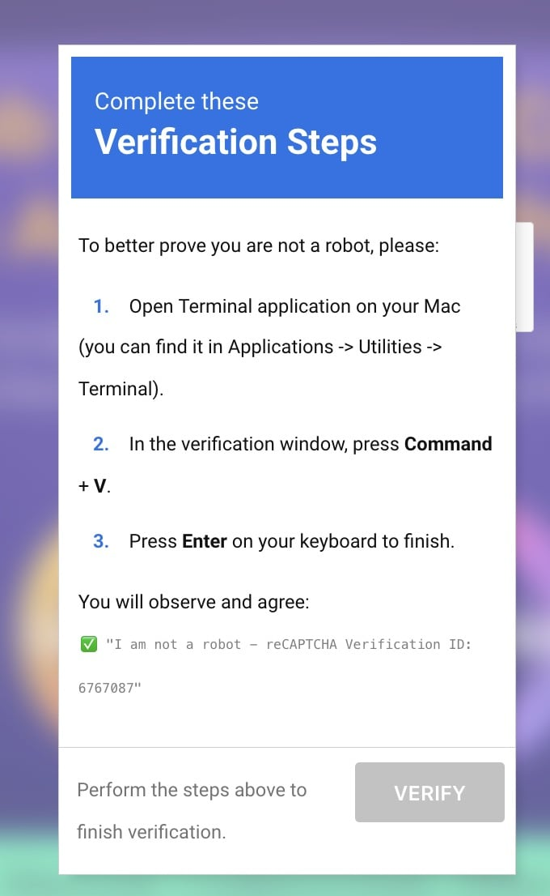

# Windows ClickFix / Fake reCAPTCHA Malware: Detection & Remediation Guide

**Target Audience:** Everyday Internet Users, Sysadmins, and Support Teams  
**Threat Name:** ClickFix Social Engineering (Delivering Lumma, Stealc, Vidar, or XMRig)  
**Platform:** Windows 10, Windows 11  

---

## 1. What is the "ClickFix" Fake reCAPTCHA Scam?

When visiting a compromised website, an authentic-looking verification popup appears stating:

> **"Verify you are not a robot"** or **"Cloudflare Security Verification Failed"**
>
> *Step 1: Press the `Windows Key + R`.*  
> *Step 2: Press `Ctrl + V`.*  
> *Step 3: Press `Enter`.*  

<div align="center">
  <br/>
  
  <p><em>Figure: The deceptive "Verification Steps" prompt instructing users to paste commands into their computer's terminal or Run dialog.</em></p>
  <br/>
</div>

### The Danger:
Legitimate security providers (like Cloudflare, Google reCAPTCHA, hCaptcha) **NEVER** ask you to open your computer’s Run prompt, paste code into PowerShell, or run terminal commands.

When you follow those instructions, you are pasting an obfuscated PowerShell script that silently installs an **Infostealer** (such as *Lumma* or *Stealc*) or a **Cryptominer**. Within seconds, it steals:
* All passwords saved in Chrome, Edge, Firefox, Brave, and Opera.
* Your active login sessions and browser cookies.
* Cryptocurrency wallet extensions (MetaMask, Exodus, Phantom, etc.).
* Discord, Telegram, and Steam session tokens.

---

## 2. How to Check If Your Windows PC Was Exposed

You can check your system in less than 30 seconds using Windows PowerShell.

### Quick Audit Procedure:
1. Click the **Windows Start Menu**.
2. Type **`PowerShell`**, right-click **Windows PowerShell**, and choose **"Run as Administrator"**.
3. Copy and paste the following one-line command, then press **Enter**:

```powershell
Get-Content (Get-PSReadLineOption).HistorySavePath -ErrorAction SilentlyContinue | Select-String -Pattern "Verification code", "superfuckingpanel", "7zip.exe", "bxor", "iex"
```

### How to Read the Output:
* **If the command returns NOTHING:** Your PowerShell history has no record of the known ClickFix script.
* **If the command displays a line starting with `<# Verification code: ... #>`:**  
  🚨 **Your computer was exposed and executed the malicious ClickFix payload.** Proceed immediately to Section 3 below.

---

## 3. Automated Cleanup via Native PowerShell Script

To clean your system **without installing third-party antivirus software**, this repository provides a dedicated native PowerShell cleanup engine: **[`Windows-Forensic-Cleanup.ps1`](Windows-Forensic-Cleanup.ps1)**.

### How to Run:
1. Open **Windows PowerShell as Administrator**.
2. Navigate to where you downloaded the script:
   ```powershell
   cd Downloads
   ```
3. **Run a Safe Simulation First (Dry-Run)**:
   ```powershell
   .\Windows-Forensic-Cleanup.ps1 -DryRun
   ```
   * Audits Win+R history, PowerShell history, staged temp files, scheduled tasks, and registry startup persistence without modifying anything.
4. **Execute the Full Remediation**:
   ```powershell
   .\Windows-Forensic-Cleanup.ps1
   ```
   * Automatically purges the malicious RunMRU command history.
   * Backs up and wipes the infected PowerShell history file.
   * Kills any running cryptominer processes.
   * Quarantines and removes dropped staging files (`7zip.exe`, `a.exe`, `a.zip`).
   * Unregisters rogue scheduled tasks and startup registry persistence.
   * Triggers a native Windows Defender deep scan in the background.

---

## 4. Manual Remediation Steps (If Not Using the Script)

If you prefer to perform manual checks without running the automated utility, follow these steps:

### Step 1: Run an In-Depth Malware Scan
Because ClickFix payloads download secondary executables into hidden folders, run a dedicated second-opinion malware scanner:

1. Download **[Malwarebytes Free for Windows](https://www.malwarebytes.com/)**.
2. Install and launch the application.
3. Click **Scan** &rarr; select **Threat Scan**.
4. If threats are found (e.g., `Trojan.Lumma`, `Spyware.PasswordStealer`), click **Quarantine**.
5. Restart your computer when prompted.

### Step 2: Clear Browser Cookies & Active Sessions
Infostealers steal temporary session cookies that allow attackers to impersonate you without typing your password. Clearing cookies invalidates these sessions locally:
1. Open your browsers (**Google Chrome**, **Microsoft Edge**, **Mozilla Firefox**).
2. Press `Ctrl + Shift + Delete`.
3. Select the time range: **All time**.
4. Check **Cookies and other site data** and **Cached images and files**.
5. Click **Clear data**.

### Step 3: Change Critical Passwords (Prioritized)
Assume any credential saved in your browser prior to the infection was exfiltrated. Prioritize changing passwords in this order:
1. **Primary Email Accounts** (Gmail, Outlook, Yahoo) — *Attackers use email to reset all your other accounts.*
2. **Web Hosting, Server & Cloud Portals** (Cloudflare, AWS, cPanel, CyberPanel, hosting providers).
3. **Banking, Financial & Cryptocurrency Accounts** (Crypto exchanges, wallets, PayPal).
4. **Social & Communication Accounts** (Discord, Telegram, GitHub, LinkedIn).

### Step 4: Enable Two-Factor Authentication (2FA) Everywhere
Even if an attacker possesses your old password, having **2FA (Authenticator App / TOTP)** enabled ensures they cannot log into your accounts.
* Use an authenticator app (Google Authenticator, Microsoft Authenticator, 1Password, or Bitwarden).
* Avoid relying solely on SMS 2FA when authenticator app options are available.

### Step 5: Wipe the Malicious Command from PowerShell History
To prevent accidental re-execution and clear the record:
Open **PowerShell as Administrator** and run:
```powershell
Remove-Item (Get-PSReadLineOption).HistorySavePath -Force -ErrorAction SilentlyContinue
Clear-History
```

---

## 4. Key Rules for Staying Safe
1. **Never copy-paste code from a website into `Win + R` or PowerShell.** No legitimate CAPTCHA requires keyboard shortcuts.
2. **Enable a Primary Password in Firefox:** (Settings &rarr; Privacy & Security &rarr; "Use a primary password"). This encrypts your saved logins on disk with a master passphrase.
3. **Use a Dedicated Password Manager:** Dedicated tools like Bitwarden or 1Password provide stronger memory and disk protection than standard browser password storage.
